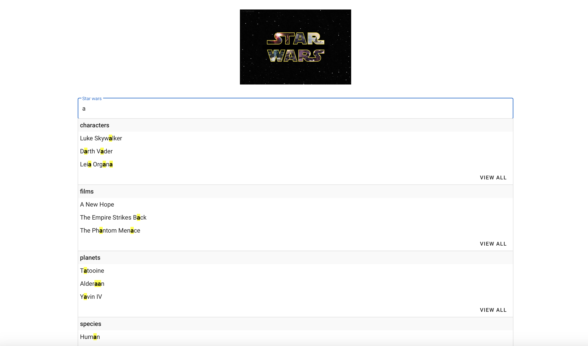
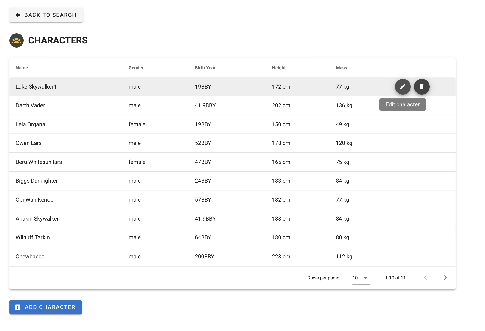
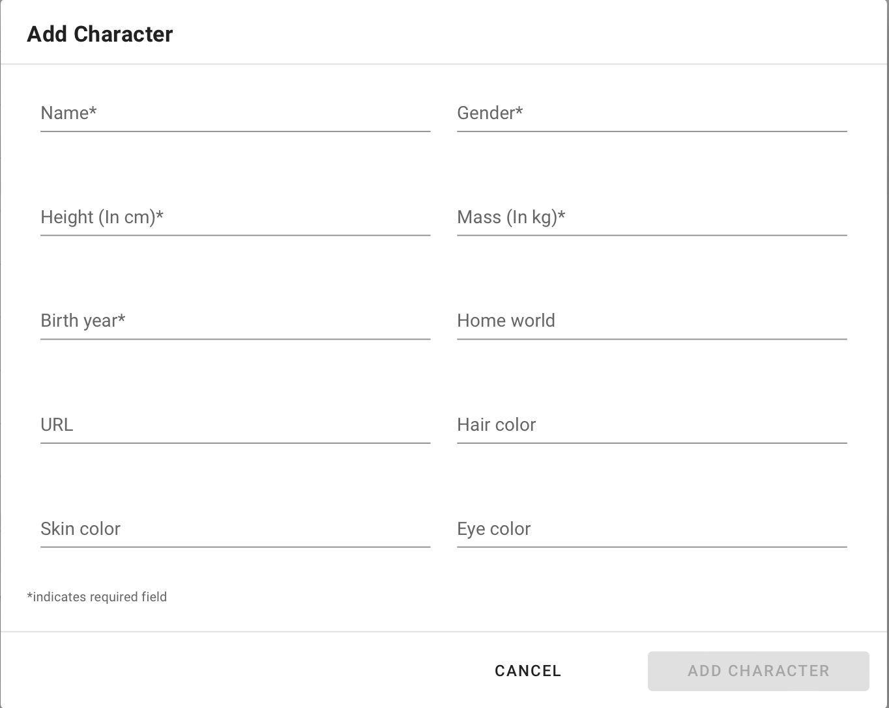
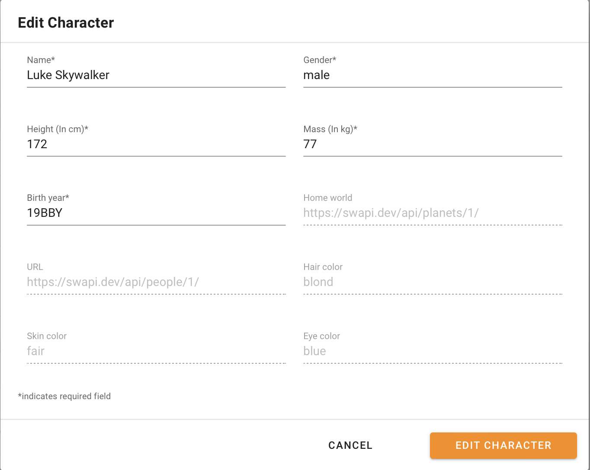
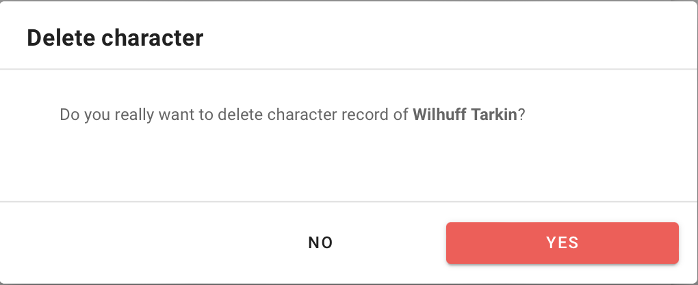

# Star Wars - Discover and Manage entities

- [Getting Started](#getting-started)
    - [Introduction](#introduction)
    - [Features](#features)
- [Components](#components)
    - [Search Entities Component](#search-entities-component)
    - [Entity List Component](#entity-list-component)
    - [Manage Entity Form Components](#manage-entity-form-components)
- [Installation](#installation)
    - [Project Setup](#project-setup)
    - [Compiles and hot-reloads for development](#compiles-and-hot-reloads-for-development)
    - [Compiles and minifies for production](#compiles-and-minifies-for-production)
    - [Run your unit tests](#run-your-unit-tests)
    - [Lints and fixes files](#lints-and-fixes-files)
    - [Customize configuration](#customize-configuration)
- [References](#references)

## Getting started
### Introduction

Star Wars is a simple, modularized, responsive, well structured, dockerized, component rich and feature loaded web application built using Vue ecosystem (Vue, Vuetify, VueX, Vue router, Vue CLI, Vue Loader), Typescript and Advance Javascript. 

List of the StarWars entities are fetched from [StarWars API](https://swapi.dev/api/) API available for all the entities and it will return the results based on search query parameter.

### Features
Some of the highlighting features of this web application are,

- Discover your favourite Star Wars entities or resources with autocomplete style component which will populate the resources on the fly as you type by highlighting the search term in the results.

- Smooth route transition to the selected entity's details page.

- Listing of the Star Wars Characters or Peoples in materialized Data Table showing the metadata of the character. The table also supports basic client side pagination and column or field level sorting.

- Apart from listing the favourite characters, the character details page also provides character management features like Add new character, Update existing character and Delete existing character.

- Better exception handling with multiple asynchronous entity search APIs.

- Store based modular, reactive and well structured global state management system.

- Better loading performance with code splitting and debouncing.

## Components

StarWars web application is built up using core building blocks like Search page, Entity List page and Entity management form components like Add, Update and Delete. These sleek components forms the basis of simple yet apealing User Interface.

### Search Entities Component

<br /><br />

This is the main landing or home page from where we can search for different StarWar entities like Characters, Films, Planets, Species, Starships, Vehicles.

- All of the above entities supports a search query string parameter which filters the set of results based on the input search term.
- To improve the search performance and to avoid calling multiple APIs for every input charcter, debouncing with delay of 1000 milliseconds between every character input is implemented.
- Once the user starts typing in the search input field, the autocomplete style grouped dropdown list will be popped down the input field where entity name is the title of every group and it will display maximum of 3 items by name or title and the search term will be highlighted in the autocomplete dropdown.
- Each group also contains View All button at the bottom right section which on clicking will redirect to the selected entity's page.

Below is the sample API request url to search people or characters having r2 as a substring.

> https://swapi.dev/api/people/?search=r2

For more details on all StarWars APIs, please refer tthe documentation [StarWars Documentation](https://swapi.dev/documentation)

### Entity List Component

<br /><br />

After clicking on View All button from any group of entities, it will be routed to the respective entity list page. The page is having dynamic icon avatar with entity name as a header and the route also will be like entity/{entityName} for all the entities. Only the Characters page features CRUD operations like Read/List, Create, Update and Delete.<br />

The characters table shows details of the character metadata like Name, Gender, Birth Year, Height and Mass. On hovering each row of the table, the Edit and Delete action icon buttons will be displayed in the rightmost column. Also, there is Add Character button at the bottom left section of the page.<br />

### Manage Entity Form Components

<br />
  

- These are the different Modal Form components and will be opened on clicking the respective action buttons from Characters table. 
- Add and Edit character components built using reusable ManageCharacterForm component where based on passed props, the modal title and submit button text populated dynamically.
- The ManageCharacterForm form is having some very basic required validations for the 5 fields which are shown in the character entity table.
- Apart from these 5 fields, rest other fields will be disabled to edit in Edit mode. 
- The Add Character button initially will be disabled and once all the mandatory fields have valid data filled in, the button will be enabled.
- In Edit character modal, if we remove data for any of the mandatory input field(s), then Edit Character button will be disabled.
- After clicking on delete icon for any character, Delete character confirmation dialog will open and after clicking on Yes button, the selected character gets deleted from the characters list.
- As there is no API available to store StarWars character, Add and Edit character actions will update the data to the list of characters array stored in VueX store

## Installation

### Project setup
After successfully cloning this project, create a feature branch from development branch for any development work. Then run below command to install all the required dependencies or packages which are required for setting up and running the application on local environment.
```
npm install
```

### Compiles and hot-reloads for development
Once all of the required dependencies gets installed successfully, now its the time to run and host the project on local development environment. Run the below command to do so. This webpack script will compile the code and will host the portal on localhost server.
```
npm run serve
```

### Compiles and minifies for production
The below command is used to minify and compile the code to generate a bundle containing minified build code alongwith html page.
```
npm run build
```

### Run your unit tests
To test the quality of the code written, you need to run below command. This command will execute all the tests written in *.spec or *.test files. This will generate a coverage report having details of Line coverage, Branch Coverage, Function Coverage.
```
npm run test:unit
```

### Lints and fixes files
The below command will solve all of the linting issues and with --fix option we can fix these issues.
```
npm run lint
```

### Customize configuration
See [Configuration Reference](https://cli.vuejs.org/config/).

### Docker configuration

To run StarWars project in docker container, the below commands needs to get executed.

- Build docker image.
```
docker build -t starwars/dockerize-starwars-app .
```

- To validate if your image has created and to know the list of images available in your system locally. use the following command.
```
docker images

```
- Run StarWars app in docker container.
```
docker run -it -p 8081:8080 -d --rm --name dockerize-starwars-app-latest starwars/dockerize-starwars-app
```

## References

[Vue JS documentation](https://v2.vuejs.org/v2/guide/) <br />
[VueX documentation](https://vuex.vuejs.org/guide/) <br />
[Vuetify component library guide](https://vuetifyjs.com/en/introduction/why-vuetify/#feature-guides) <br />
[StarWars API](https://swapi.dev/api/) <br />
